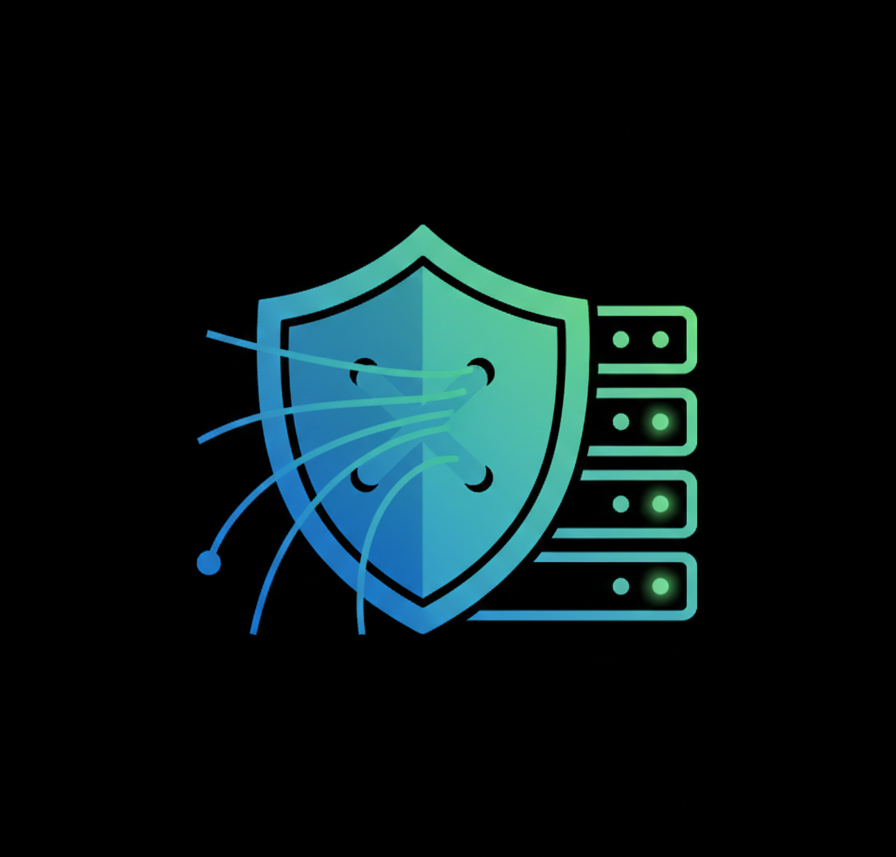
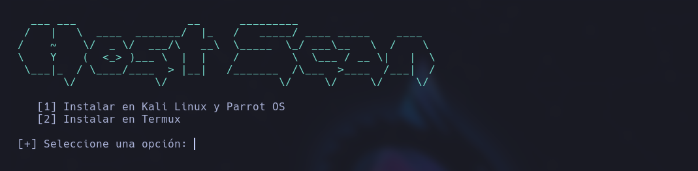

# Host Scan 🔍

<p align="center">
  
</p>

## 📌 Objetivo Técnico

**Host Scan** es una herramienta desarrollada en Python para el análisis eficiente de puertos (TCP/UDP) en sistemas remotos, integrando capacidades de evasión básica de firewalls y concurrencia optimizada mediante ThreadPoolExecutor.

Este proyecto ha sido estructurado bajo los principios de **DevSecOps**, asegurando calidad, escalabilidad y separación estricta entre entornos de investigación privados y versiones públicas.

---

## 🏗️ Arquitectura del Repositorio

El repositorio sigue una estructura estándar profesional y escalable:

```
📦 Host-Scan
 ┣ 📂 src/        # Código fuente principal (scan.py)
 ┣ 📂 tests/      # Pruebas unitarias preparadas para CI/CD
 ┣ 📂 scripts/    # Scripts de automatización y sanitización (publish_public.ps1, setup.sh)
 ┣ 📂 configs/    # Configuraciones específicas por entorno
 ┣ 📂 docs/       # Documentación oficial y diagramas (imágenes)
 ┣ 📜 .gitlab-ci.yml  # Pipeline para validación, testing y security checks
 ┗ 📜 README.md   # Documentación principal
```

---

## 🛡️ Flujo DevSecOps y Repositorio Dual (GitLab → GitHub)

El ciclo de vida del desarrollo se divide en dos entornos principales garantizando la seguridad operacional:

1. **GitLab (Private Lab - Source of Truth)**:
   Contiene el entorno completo de desarrollo funcional, incluyendo pipelines de integración continua (.gitlab-ci.yml), baterías de tests exhaustivos (`tests/`), scripts de automatización no ofuscada y logs reales. En este repositorio ocurren los desarrollos y auditorías primarias de código.

2. **GitHub (Portfolio Público - Sanitizado)**:
   Sirve estrictamente como portafolio y referencia de código público para mostrar madurez técnica. Carece de componentes delicados, scripts iterativos privados, variables configurables o dependencias inyectables que representen riesgos.

### 🔄 Automatización de la Publicación (`scripts/publish_public.ps1`)

La inyección de la versión pública es gestionada por el script `publish_public.ps1`. Este script actúa como un puente unidireccional (GitLab → GitHub), aplicando **Sanitización Automática**. Sus responsabilidades incluyen:
- Verificar el estado del código base local.
- Eliminar la inclusión técnica de áreas críticas (`tests/`, `configs/`, lógica experimental en desarrollo y el mismo CI pipeline de GitLab).
- Aislar en una rama huérfana temporal de despliegue (`public`).
- Realizar un push forzado y controlado a la cuenta de GitHub pública minimizando el riesgo de filtración de vectores sensibles u operacionales privados.

---

## ⚙️ Análisis e Integración Continua (CI/CD)

El pipeline de GitLab define 3 fases clave para mantener la pureza del código y el aseguramiento de calidad (Quality Assurance):
- **Linting:** Revisión estricta de estándares y PEP-8 a través de `flake8`.
- **Testing:** Validación unitaria básica del core a través de `pytest`.
- **Security:** Análisis dinámico automatizado para detectar debilidades de código con `bandit`.

---

## 🚀 Uso del Escáner (Entorno Controlado)

### Requisitos Mínimos
- Entorno Linux (Debian, Arch o derivados) o Android (Termux).
- Python 3.8+ instalado.

### Instalación Rápida
```bash
sudo bash scripts/setup.sh
```

### Ejecución
```bash
python3 src/scan.py
```

<p align="center">
  
</p>

---

## ⚖️ Aviso Ético y Responsabilidad

> [!WARNING]
> Este proyecto (`Host Scan`) ha sido concebido y distribuido primordialmente con fines de **investigación, auditoría autorizada y usos educativos en ciberseguridad**. La ejecución de software para escaneo, recolección de huellas cibernéticas o mapeo de redes sin autorización explícita conformada y documentada, constituye una actividad intrusiva, punible y potencialmente ilegal o criminal bajo varias legislaciones a nivel mundial.
>
> **Toda actividad debe poseer un alcance legal claramente definido. El desarrollador no asume responsabilidad civil, formativa o punitiva derivada de las acciones y consecuencias suscitadas por el uso del software.**
