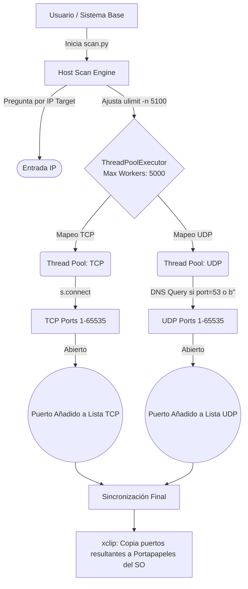
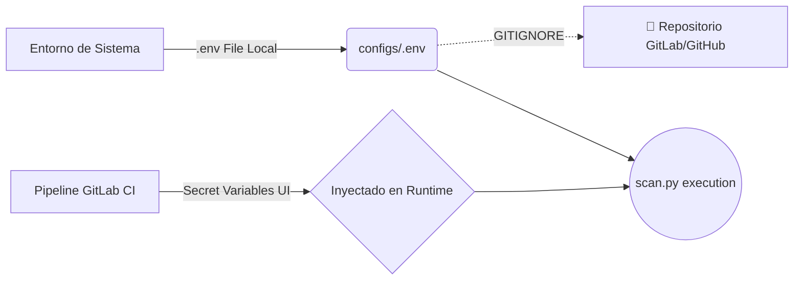

# Host-Scan Architecture Diagram

This document illustrates the high-level architecture, thread lifecycle, and DevSecOps isolation flow of the **Host-Scan** project.

---

## 🏗️ 1. Core Execution Flow

The core engine uses `concurrent.futures.ThreadPoolExecutor` to perform ultra-fast, concurrent socket evaluations across TCP and UDP protocols.

## 🛡️ 2. DevSecOps & Pipeline Flow

Demonstration of how the laboratory code separates into a pristine portfolio showcase and a technical execution lab.

```mermaid
sequenceDiagram
    participant Dev local
    participant GitLab (Public Lab)
    participant PowerShell (Sanitization)
    participant GitHub (Portfolio)

    Dev local->>GitLab (Public Lab): Push full code (tests, configs, scripts, pipeline)
    rect rgb(30, 30, 60)
    Note over GitLab (Public Lab): CI/CD Execution
    GitLab (Public Lab)->>GitLab (Public Lab): flake8 (Linting)
    GitLab (Public Lab)->>GitLab (Public Lab): pytest (Automated testing)
    GitLab (Public Lab)->>GitLab (Public Lab): bandit (Static security check - SAST)
    end
    
    Dev local->>PowerShell (Sanitization): Runs `publish_public.ps1`
    Note over PowerShell (Sanitization): Orchestration started on branch 'main'
    PowerShell (Sanitization)->>PowerShell (Sanitization): Create detached branch 'public'
    PowerShell (Sanitization)->>PowerShell (Sanitization): git rm --cached 'tests/', 'configs/', 'scripts/', '.gitlab-ci.yml'
    PowerShell (Sanitization)->>GitHub (Portfolio): Force push branch public:main (Sanitized code)
    PowerShell (Sanitization)->>Dev local: Return to branch 'main' securely
```

## 🔐 3. Configuration Management Strategy

Environmental configurations strictly handled via `configs/` folder and ignored by Git to avoid secrets leakage.

